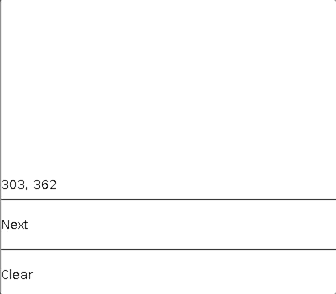
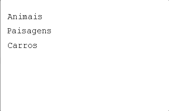
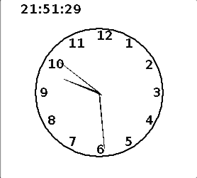

# feeling-java-1997

These were the first code of my life - in Java back in 1997! 😍

It was tricky to make the Applets run nowadays, but there it is! If you wanna run them, use the Chrome plugin CheerpJ Applet Runner.

The folder structure is the "original", which mean, just throwing files while studying and running them! 😅

It was very nice to see those things running today 😍 (2022).

Some screenshots of the applets in action:

</img>

</img>

</img>

</img>

</img>

